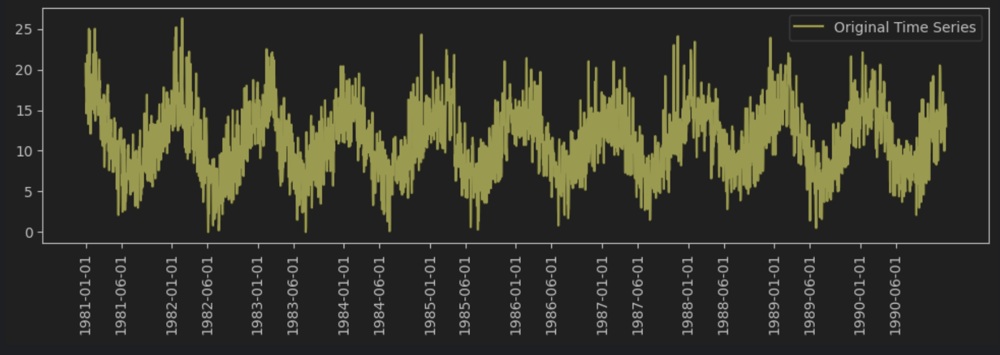
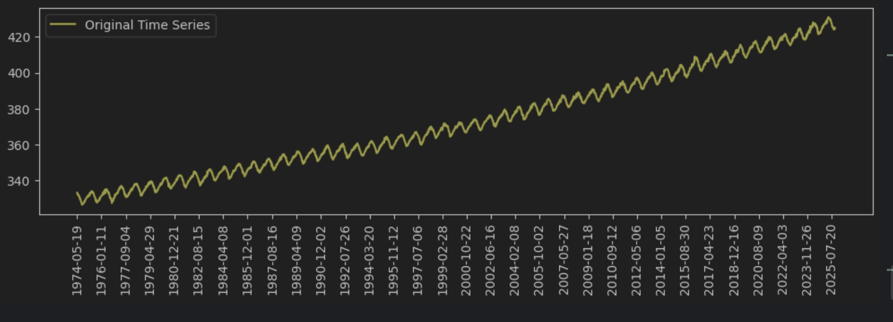
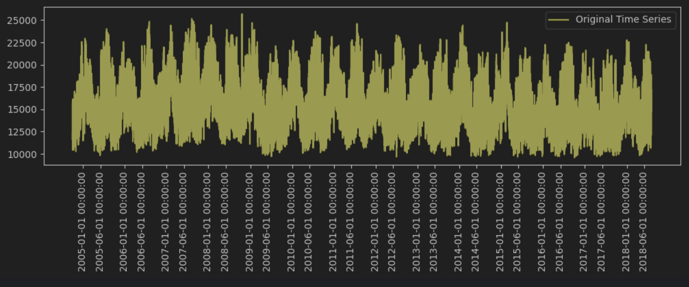
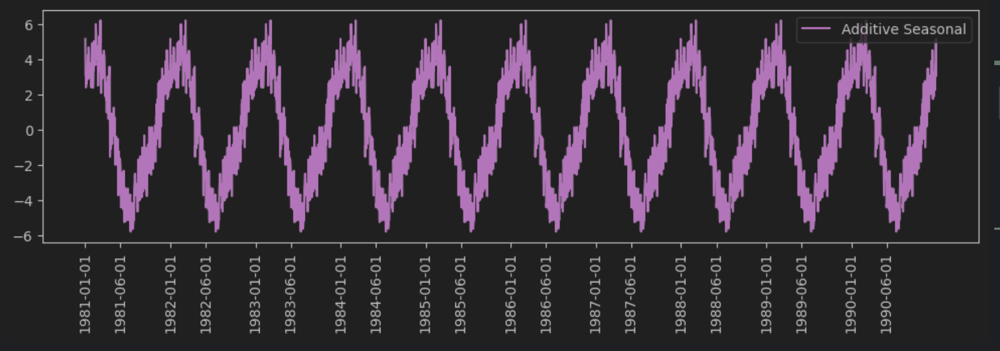
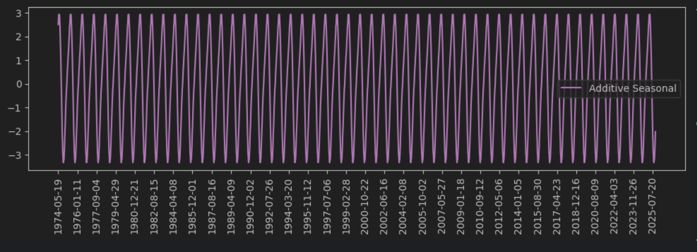
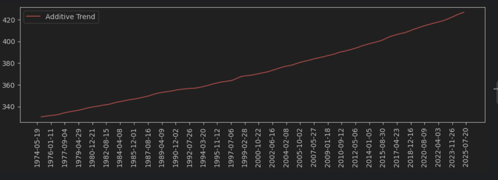
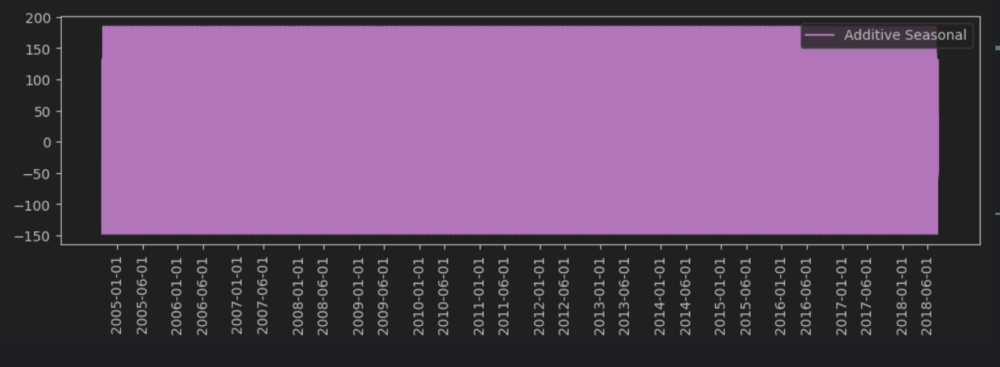

# Time-Series

Homeworks for Time Series course.

1. Minimum Temperatures - https://www.kaggle.com/datasets/paulbrabban/daily-minimum-temperatures-in-melbourne
2. Weekly Co2 -  https://gml.noaa.gov/ccgg/trends/data.html?utm_source=chatgpt.com
3. Hourly Energy Consumption - https://www.kaggle.com/datasets/robikscube/hourly-energy-consumption?utm_source=chatgpt.com

---
## Assignment 1

Data canalization and pre-processing.

**Minimum Temperatures** - series contains information from `1981-01-01` to `1990-12-31`. This dataset describes mean daily temperature in Melbourne.

**Weekly Co2** - series contains information from `1974-05-19` to `2025-10-12`. This dataset describes average weekly Co2 in Mauna Loa.

**Hourly Energy Consumption** - series contains information from `1981-01-01 01:00:00` to `1990-12-31 00:00:00`. This dataset describes hourly energy consumption in US.

---
## Assignment 2

Simple plots + each year subplot

### Tempt ssimple plot

### Co2 simple plot

### MW simple plot

---
## Assignment 3

Again simple plots, seasonal plot + trend

### Tempt seasonal plot

### Co2 seasonal plot

### Co2 Trend plot
Only Co2 series has trend.

### MW seasonal plot

---
## Assignment 4

---
## Assignment 5

---
## Assignment 6

---
## Assignment 7

---
## Assignment 8
